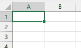

[Home](https://cityssm.github.io/tip-of-the-month/)

# Bringing a Table on the Web into Excel

**Tip of the Month - January 2024**

The following request came across my desk.

> Is there any way to drop the data from [a table in a web browser] into Excel?

The short answer is yes (provided it's an actual table and not just something that looks like one).
It's quite easy to do with a simple "copy-paste".

💡 Note that this tip does not maintain a link to the table on the web page.
If the table on the web page changes, the spreadsheet will not automatically update to reflect the changes.
There are ways to maintain a link to the web page, but that was more than what the requestor needed at the time.

---

To get started, open Excel and open your web browser of choice.
It's always easier to move content between applications when both are read to go.
In your web browser, and navigate to the web page containing the table.

_If you're looking to follow along, grab some [hourly weather data from Environment Canada](https://climate.weather.gc.ca/climate_data/hourly_data_e.html?hlyRange=1961-08-01%7C2012-03-20&dlyRange=1945-06-01%7C2012-03-19&mlyRange=1945-01-01%7C2012-03-01&StationID=4093&Prov=ON&urlExtension=_e.html&searchType=stnProx&optLimit=specDate&StartYear=1950&EndYear=1950&selRowPerPage=25&Line=0&txtRadius=25&optProxType=navLink&txtLatDecDeg=46.533333333333&txtLongDecDeg=-84.5&timeframe=1&time=LST&Year=2000&Month=1&Day=1)._

When copying the table, keep the following in mind for the best results.

- **Try to select the full table, or at least full rows.**
  Start selecting in the top-leftmost cell, and stop selecting in the bottom-rightmost cell.
  Copying a partial column can give you strange results.

- **Try to avoid including titles and paragraphs outside of the table.**
  Excel can usually handle the extra content, but it can give you strange results.

In Excel, select the cell that should receive the table.
For the best results, use an empty sheet, and paste into the top-leftmost cell A1.

Once in Excel, you'll likely have some cleaning up to do.

- If the table data includes links, you can remove them by right-clicking them,
  and choosing "Remove Hyperlink".

## More Tips This Month

- [Keyboard Shortcuts in Windows](keyboard-shortcuts.md)
- [Annual Digital Cleanup](digital-cleanup.md)
