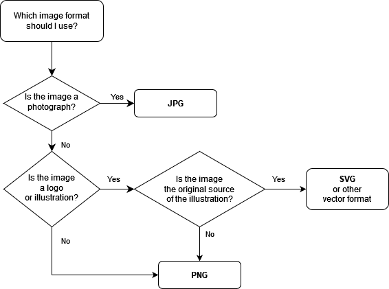

[Home](https://cityssm.github.io/tip-of-the-month/)

# Image Types

**Tip of the Month - February 2024**

Not all image types are created equally. Choosing the right image format ensures that the image will still be usable for years to come.

## Raster Formats

Raster formats are based on pixels.

Many image editors provide their own formats to help maintain additional data for editing purposes,
but when it comes to sharing the image with others, one of the options below should be used.

| File Type  | Ideal Uses                                                       | Less Ideal Uses                                          |
| ---------- | ---------------------------------------------------------------- | -------------------------------------------------------- |
| **PNG** ⭐ | Photographs, logos, drawings                                     |                                                          |
| JPG        | Photographs                                                      | Logos because transparent backgrounds are not supported. |
| GIF        | Short animations, drawings, things with transparent backgrounds. | Photographs because of colour limitations.               |
| TIFF       | High-quality, profession grade photographs and scans.            | Sharing, as the file sizes are large.                    |
| BMP        |                                                                  | Dated format, other formats are preferred.               |

### More Raster Formats

- **HEIC** is an Apple-specific format used by iPhones to take photographs. The format is not well supported outside of Apple devices.

### Pros of Raster Formats

- Easy to view by most people.

### Cons of Raster Formats

- Do not scale up well.

## Vector Formats

Vector formats use mathematical formulas to generate.

| File Type                            | Ideal Uses                                            | Less Ideal Uses                                                                              |
| ------------------------------------ | ----------------------------------------------------- | -------------------------------------------------------------------------------------------- |
| **SVG** (Scalable Vector Graphic) ⭐ | Logos, illustrations, commercial printing, embroidery | Photographs                                                                                  |
| AI (Adobe Illustrator)               | Logos, illustrations, commercial printing, embroidery | Photographs, sharing with a broad audience, long term archiving as the format is proprietary |

### Pros of Vector Formats

- Infinite scalability without losing image quality.
- Easier to edit as each piece is maintained as a separate object.

### Cons of Vector Formats

- May need extra software to open.
- Not well suited for photographs.

## Choosing the Right Image Type

## More Reading

- [Image Files - Adobe Creative Cloud](https://www.adobe.com/ca/creativecloud/file-types/image.html)

## More Tips This Month

- [The Dangers of Improper Redactions](improper-redactions.md)
