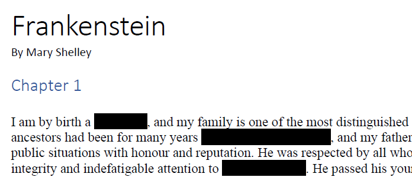
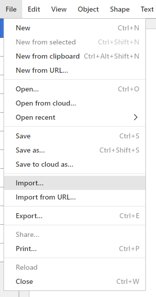
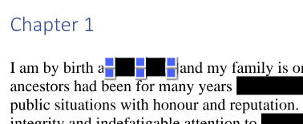
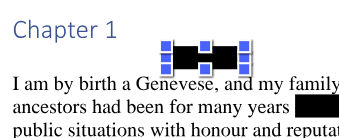

[Home](https://cityssm.github.io/tip-of-the-month/)

# The Dangers of Improper Redactions

**Tip of the Month - February 2024**

Have you ever received a PDF with redactions? Have you ever applied redactions to a PDF?
Are you sure those redactions were applied correctly?

💡 If you want to follow along with this demo, download a copy of the
["Redacted" Version of Mary Shelley's Frankenstein](frankenstein.pdf).

## Step 1: Choose an SVG Editor

There are a couple free options available, both of which work for this demo.

[Boxy SVG](https://boxy-svg.com/) 
Works right in your (Chrome) web browser. No installation required.
If your browser is supported, visit the page, and click "Launch App".

[Inkscape](https://inkscape.org/) 
Installation required. Works on Windows, Mac, and Linux.

## Step 2: Import the PDF into the SVG Editor

**For the purposes of this demo, Boxy SVG will be used, however Inkscape works similarly.**

Under the File menu, select Import. Browse to your saved PDF file, and open it.

## Step 3: Select a Redaction Rectangle

Select the redaction by clicking on it. Depending on the complexity of the PDF document,
selecting the redaction may require some double clicks,
as you narrow your focus and select smaller items within larger groups of items.

## Step 4: Move the Selection

Once the redaction is selected, try to move it. Drag it out of the way, or use the arrow keys to shift its position.

😱 Whoa!

## What Can I Do?

All is not lost when it comes to redacting. It just needs to be done right to ensure the redactions are properly applied,
and not just covering things up.

If you have [**Adobe Acrobat Pro**](https://www.adobe.com/ca/acrobat/acrobat-pro.html),
there is a Redact tool that ensures the redacted content is properly removed.

The City of Sault Ste. Marie has a free, open source tool called [**PDF Flattener**](https://github.com/cityssm/pdfFlattener)
that flattens each PDF page into a single image, effectively removing the ability to move the redactions.
A simple tutorial, [How To Redact Text in Adobe Acrobat Reader for Free](https://github.com/cityssm/pdfFlattener/blob/master/HOWTO.md)
is included. **Just be sure to flatten the PDF afterwards with PDF Flattener.**

## More Tips This Month

- [Image Types](image-types.md)
