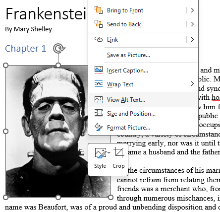
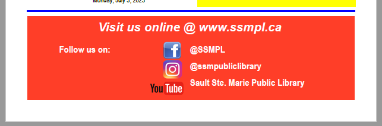
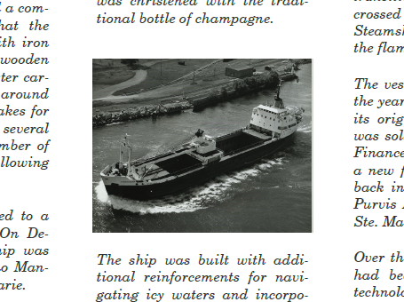
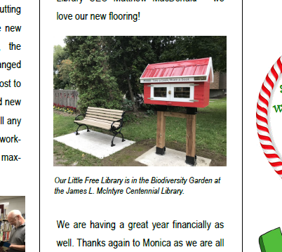
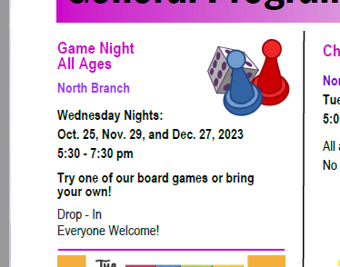

[Home](https://cityssm.github.io/tip-of-the-month/)

# Writing Good Alternative Text

**Tip of the Month - March 2024**

**Alternative text** (or alt text) refers to the descriptive text that is associated with images
behind the scenes in documents and web pages.
Think about looking at an image, and how you would describe it to someone over the phone.
That would be the alt text!

It is important when sharing documents electronically
that meaningful alternative text is provided for all images that are not purely decorative.
This text is used by screen readers (like [Acrobat's Read Out Loud feature](pdf-read-out-loud.md)) and other assistive technologies to describe the image to the reader.

## Viewing and Setting Alternative Text in Microsoft Word

To set the alternative text for an image in Microsoft Word, right-click it.
From the popup menu, select "View Alt Text".

Complete the form to provide meaningful alternative text,
or mark the image as decorative.

## Examples of Good Alternative Text

Below are some examples of documents that are shared electronically,
and should have alternative text behinds the scenes.

### Example 1 - Images with Information Inside

Newsletters oftentimes are designed to be visually pleasing. This means images.
However, when newsletters are shared electronically, it is important to remember that if those images
contain important information, that information needs to be provided in a way that is
accessible to assistive technologies. Otherwise, all of that information will be completely ignored.

In the case above, this can be done be defining alternative text for each of the poster images.
The top-most image regarding the Library's Giving Tree would benefit from alternative text like:

    Sault Ste. Marie Public Library Giving Tree
    The Sault Ste. Marie Public Library is accepting donations for our Giving Tree,
    from November 14 to December 29, 2023.
    Donations of new items such as hats, mitts, gloves, socks, etc. will be gladly accepted at
    the James L. McIntyre Centennial Library at 50 East Street
    and
    the North Branch at 232C Northern Avenue East.
    Give what you can. Take what you need.
    For more information, call 705-759-5231.

Note that not all alternative text needs to be this lengthy.
Also, don't worry too much about the formatting of the alternative text
as it's meant to be used by assistive technologies.

### Example 2 - Images used as Labels

In the example above, images of social network logos are used to describe
which handle corresponds to which social network. Without proper alternative text,
there is no way for assistive technologies to know what network a handle corresponds to.

The Facebook logo should have alternative text "`Facebook`",
the Instagram logo should have alternative text "`Instagram`",
and the YouTube logo should have alternative text "`YouTube`".

### Example 3 - Images in Articles

Images added as part of articles should have alternative text that describes what is in the image.

In the example above, good alternative text may be:

    An aerial view of the Yankcanuck in April 1963.

An exception is when a descriptive caption is included with the image.
Although the image is not entirely decorative, the alternative text for the image
is included within the article itself.

If alternative text was provided for the image, assistive technologies would announce
the alternative text followed by the caption, essentially describing the image
to the reader twice.
If there is additional information that should be conveyed in the image's alternative text,
then it should be added. Otherwise, the image should be marked as decorative.

### Example 4 - Decorative Images

Not all images need to be described to users of assistive technologies.
In the example above, the image of the game pieces is considered decorative,
since it provides no information that needs to be relayed through assistive technologies.

Many document authoring tools, like Word, ask document authors to explicitly
mark images like these as "decorative", to recognize that they are safe to ignore.

## More Reading

- [Microsoft - Everything you need to know to write effective alt text](https://support.microsoft.com/en-us/office/everything-you-need-to-know-to-write-effective-alt-text-df98f884-ca3d-456c-807b-1a1fa82f5dc2)

## More Tips This Month

- [Read Out Loud in Adobe Acrobat Reader](pdf-read-out-loud.md)
