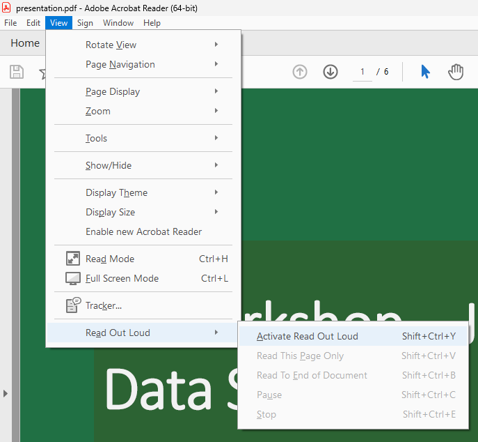
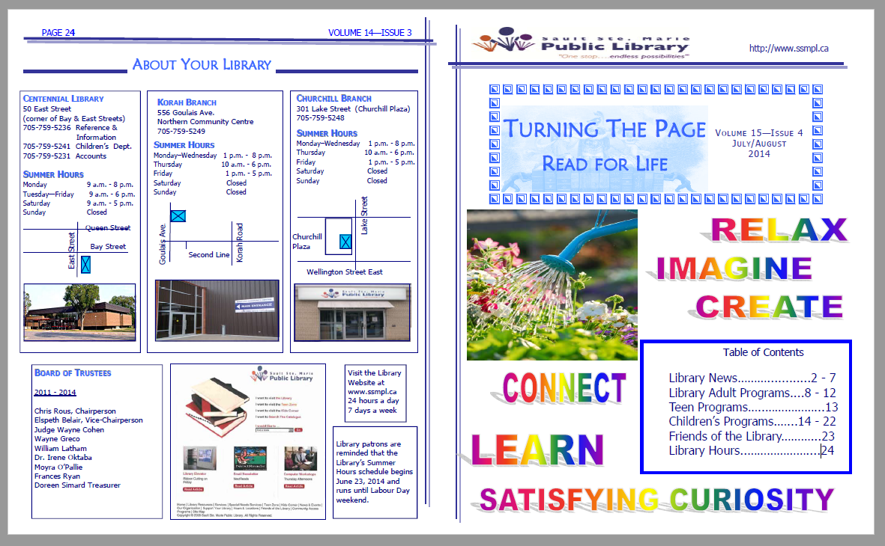

[Home](https://cityssm.github.io/tip-of-the-month/)

# Read Out Loud in Adobe Acrobat Reader

**Tip of the Month - March 2024**

Adobe Acrobat Reader has a built-in screen reader that can read out loud the content of a PDF.
It is important when sharing documents as PDFs that the content of the PDF is accessible to the built-in screen reader,
but also makes logical sense when read by the screen reader.

## Activating Acrobat's Screen Reader

To activate the "Read Out Loud" feature, start by opening the PDF of your choice.
Under the "View" menu, expand "Read Out Loud" and select "Activate Read Out Loud".

Once activated, you can choose to read the current page,
or read the entire document.

## Is all of content in the PDF that should be announced properly announced?

Sometimes **floating items** are announced in the right order,
or announced at a time you may not expect, causing confusion for the listener.

- [**Try out the read out loud feature with this PDF, full of floating items.**](alphabet.pdf)

Sometimes **images** do not have descriptive text associated with them,
so if they are relied on for information, they may be ignore entirely.

- [**Try out the read out loud feature with this PDF, a poster with a calendar of events.**](poster.pdf)

## Tips for Making Screen Reader Friendly PDFs

### ⚠️ Avoid floating textboxes and images

It's difficult to get them in the proper reading order.
Documents written in a sequential order are far easier to convert into accessible PDFs.

### ⚠️ Use text for information wherever possible

It can be tempting to share a poster-like image in a PDF containing all sorts of information.
Unfortunately, [unless the image has descriptive text associated with it](alternative-text.md),
all of the information inside of the image will not be announced to the reader.

### ⚠️ Beware of sharing brochures

It can be tempting to simply share brochures that are designed to be printed.
Oftentimes brochures can have multiple printed pages on the same page not in the proper reading order
since they are meant to be printed and folded.
This can result in confusion when read in the order they appear in the PDF.

### ⚠️ Beware of improperly redacted PDFs

As mentioned in last month's tip and demo,
[improperly redacted PDFs can have their redactions removed visually](../02-feb/improper-redactions.md).
Improper redactions are also ignored by the read out loud feature, and announced to the reader.

### ✅ If your application has built in accessibility checks, use them before exporting the PDF

Microsoft Office applications have [built-in accessibility checks](https://support.microsoft.com/en-us/office/improve-accessibility-with-the-accessibility-checker-a16f6de0-2f39-4a2b-8bd8-5ad801426c7f)
to warn about potential accessibility issues.
It's best to fix as many issues as possible in the source document before converting the document to a PDF.

### ✅ If your application exports directly to PDF, use that option first

Microsoft Office applications, and others, provide an option to export documents as PDFs.
This option is preferred over "printing to PDF", as some accessible information can get lost in the print process.

## Want to Do More Screen Reader Testing?

Windows has a built-in screen reader called Narrator that can read out loud documents in other applications
like Microsoft Office applications and web browsers.
See Microsoft's [Complete Guide to Narrator](https://support.microsoft.com/en-us/windows/complete-guide-to-narrator-e4397a0d-ef4f-b386-d8ae-c172f109bdb1) for help getting started.

Most other operating systems have built-in screen readers as well, like [VoiceOver](https://support.apple.com/en-ca/guide/voiceover/welcome/mac) on the Mac.
Alternatively, there are screen readers available to download.
[NVDA](https://www.nvaccess.org/) is a free option for Windows.

## More Tips This Month

- [Writing Good Alternative Text](alternative-text.md)
