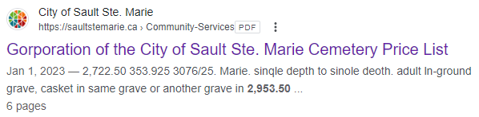
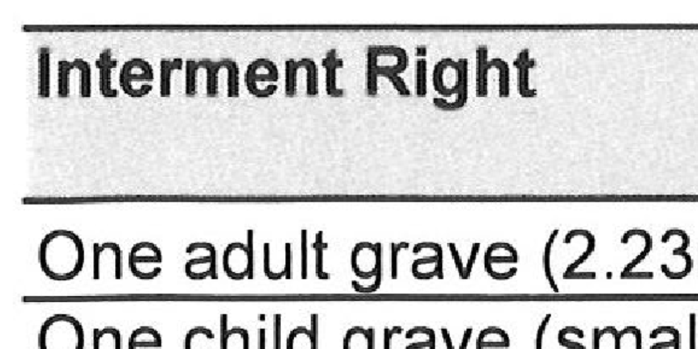
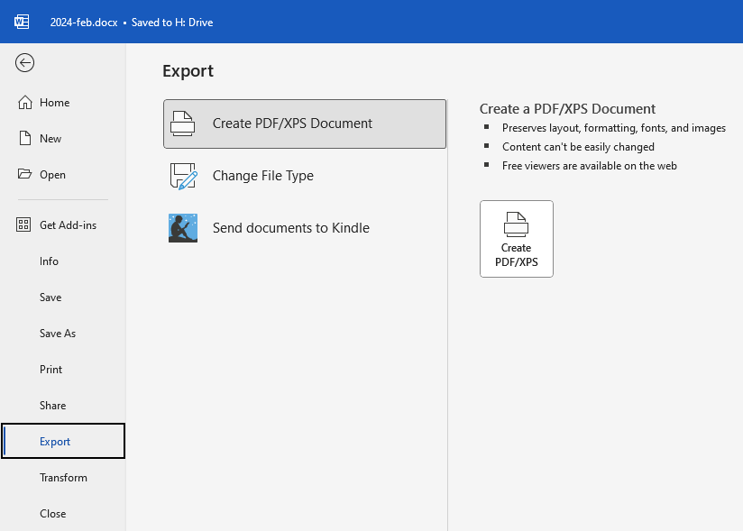
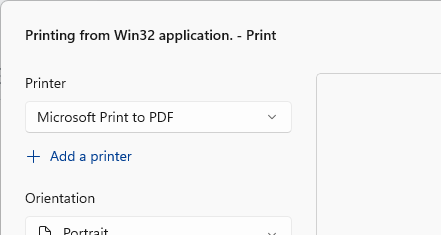
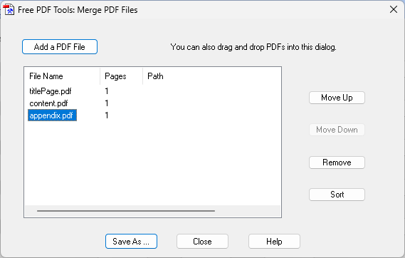

[Home](https://cityssm.github.io/tip-of-the-month/)

# Stop Printing and Scanning to Create PDFs

**Tip of the Month - April 2024**

The following request came across my desk after the following was discovered in the Google search results.

> I'm not sure how to fix this on Google. I've looked at the webpage and the file but I don’t see anything.

The PDF that resulted in these awkward search results is [archived here for reference](scanned.pdf).

The reason for the awkward search results comes down to how the PDF was created in the first place.

## The Ol' Print and Scan

In the (distant) past, generating PDFs from documents was quite an involved process.
It often required extra software to do, and sometimes that software had a cost.

A cheap alternative using the resources already in the office was to print the document to paper,
then use the office copier to scan the paper back into the computer as a PDF document.
Some copiers would even use Object Character Recognition (OCR) to add searchability to the PDF.
The result was a PDF, which some would consider a success, however that PDF came with a host of problems.

### What's the Problem?

One problem with PDFs generated in this way are the file sizes.
PDFs generated from office copiers are pages of large images.
Even for what seems like a relatively small document, these resulting files can become too large to email,
and slow to download when shared online.

Another problem is scalability. Since the PDF is made up of images, it doesn't zoom well,
and may include dust artifacts from the scanning process.

Lastly, and most importantly, accessibility takes a **huge** hit.
Users that rely on tools like [Acrobat's Read Out Loud](../03-mar/pdf-read-out-loud.md),
and other assistive technologies cannot easily use them to read the PDF.

## Making PDFs the Right Way

_Wherever possible, no paper should be harmed in the creation of PDFs._

Many document authoring applications, like Microsoft Word, have the ability to create PDFs from the application itself.
By using the application's PDF tools, the resulting PDF will better maintain it's clarity, and most importantly,
maintain it's content as text, compatible with assistive technologies.

For applications that do not have the ability to export to PDF directly,
a PDF printer is a great alternative.
Rather than generating a piece of paper, a PDF printer generates a PDF.
"Microsoft Print to PDF" is a PDF printer included with Windows.
Alternatively, there are third party PDF printers available, like [doPDF](https://www.dopdf.com/),
that can also generate PDFs from any application able to print.

### But What About Combining Documents from Multiple Sources?

One of a common arguments I hear for generating PDFs using an office copier
is that the PDF has pages from multiple sources,
like a title page from a desktop publishing tool,
some writeup from Microsoft Word,
and an appendix spreadsheet from Microsoft Excel.

When combining documents from multiple sources, a tool like
[PDFill PDF Tools](https://www.pdfill.com/pdf_tools_free.html)
can be used to combine multiple PDFs into a single PDF.
Use each application's PDF export features or a PDF printer to generate each PDF,
then merge them together into one PDF.
