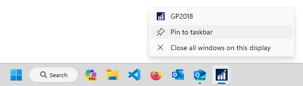
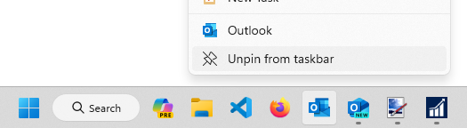
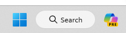
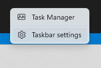
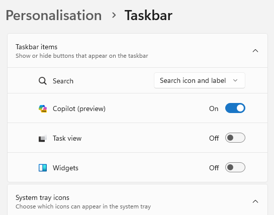

[Home](https://cityssm.github.io/tip-of-the-month/)

# Pin to Taskbar in Windows 11

**Tip of the Month - May 2024**

Possibly the most convenient location for links to regularly used applications is right beside the Start button
in the taskbar. Not only does this make applications easy to access, it also helps maintain an order,
if for example, you prefer your left most application to always be your email client.

Adding and removing pinned applications is easy to do.

## Add a New Pinned Application

The easiest way to pin a new application to the taskbar is by opening in.
Once open, right-click the icon, and choose "Pin to Taskbar".

If the newly pinned application isn't where you want it,
icons can be reordered by dragging them to the location you prefer.

## Removing a Pinned Application

There is no need for the extra clutter that comes with pinned applications you rarely use.
Removing pinned applications is straightforward too. There is no need to open them first.
Right-click the icon you want to remove, and choose "Unpin from Taskbar".

## Removing "Copilot (Preview)"

If you tried to remove the "Copilot (Preview)" icon by right-clicking on it,
you will be disappointed. There is a different method to follow to remove it.

Right-click any empty space in the taskbar. Choose "Taskbar settings".

In the new window under "Taskbar items", look for "Copilot (Preview)".
Click the switch to change it to "Off".
Remove any other unneccessary taskbar items that you don't use.

While you're here, browse the other settings to make your taskbar work for you.

- Select the icons that should always be visible in the system tray (on the right next to the clock).

- Set the alignment of the taskbar to the centre (default in Windows 11),
  or to the left (previous behaviour).

- Adjust how the taskbar works on a multi-screen setup.

- Set when taskbar items for the same application should combine (or not).
