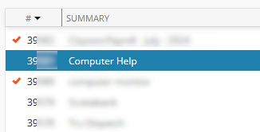
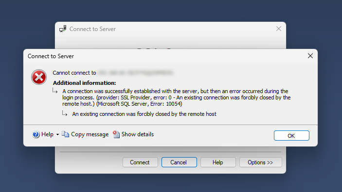

[Home](https://cityssm.github.io/tip-of-the-month/)

# Writing Good Helpdesk Tickets

**Tip of the Month - August 2024**

**The IT Helpdesk wants to help you.**
They want to identify your _IT-related_ issue as efficiently as possible,
and provide you with a solution to get you back up and running as soon as possible.

When you have an issue requiring IT staff's attention, that interaction
with the IT Helpdesk is oftentimes initiated by creating a ticket via email.
When that starting point is clear and complete,
IT staff can assign the ticket and get to work right away.

Here are some tips to ensure your ticket is ready to be worked on when it arrives.

## Include a Descriptive Subject Line

**The email subject appears prominently in the ticketing system.**
A ticket with a good subject line can be routed right away.
When the subject line is less clear (or omitted entirely), additional consideration is required.
While detailed descriptions should remain in the email body, the email subject should
at the very least **include the thing that is not working**, be it the name of the application,
or the physical part of the computer that is failing.

Some examples of good ticket subject lines:

- Central Collections Station 1 Debit Machine Down
- Trouble Logging into _"Application Name"_
- Workstation Monitor Not Turning On

Clear subject lines also assist IT staff with identifying ticket patterns.
If several tickets all cite the same application in the subject line,
IT staff can more easily identify larger problems that may be related.

## Include Details in the Body

The body of the tickets should provide additional details that would be helpful to the IT staff.
You don't need to be lengthly, but try to answer the following questions.

**What were you expecting to happen?**

- Provide a short description of what "success" should look.
  This allows IT staff working on the issue to know when the issue is fixed.

**Is anyone else in your area having the same issue?**

- If other users are experiencing the same issue, the problem is likely related to the application.
- If you are the only one experiencing the issue, the problem is likely related to 
  your individual configuration.

**Has this issue happened before?**

- If so, when abouts? IT staff can look over the previous tickets related to your issue for previously
  successful solutions. This is especially helpful when a different technician has been assigned to your issue.

## Whenever Possible, Include Screenshots

Does something look weird? Did an error message appear on your screen?
Use the <kbd>Print Screen</kbd> button on your keyboard to copy an image of what is currently
on your screen to your computer's clipboard.
Paste that image into the image editor of your choice to clean it up,
or paste it directly into your ticket email.

If you do choose to clean up your screenshots, try not to crop the images too tightly.
For example, if the problem is occurring on a website,
cropping out the web browser window will likely result in the followup question,
"What web browser were you using?"

## Include Contact Information

> "Joe who?"

Make sure to provide your full name, area you work in, and how to best contact you.
A lot of those details may already be included in your email signature,
but if a cell phone is the best point of contact, be sure to include that number.

## I've sent in my ticket. Now what?

Your ticket is now in the hands of the IT staff,
but your responsibility doesn't end there.

**Be available for followup questions.**

- If IT staff need to work with you on the issue, you need to be available.
- If anything is unclear in the ticket, IT staff will likely reach out for clarity.
- If you can't be reached and don't respond to questions related to your ticket,
  your ticket may not receive priority.

**Be Patient.**

- There may be more pressing issues than your own.
- Your issue may be related to another issue that is already being worked on.
- Fulfilling requests for "updates" takes up time that could be used solving your issue.

**Update the ticket if things change.**

- If you have additional details that may be of assistance, add them to the ticket.
- If the issue has resolved itself, update the ticket to let IT staff know the ticket can be closed.
  They may still want to look into why the issue occurred in the first place,
  but they can prioritze that research time accordingly.

## More Tips This Month

- [Be "Cloud Fail" Resilient](be-cloud-fail-resilient.md)
