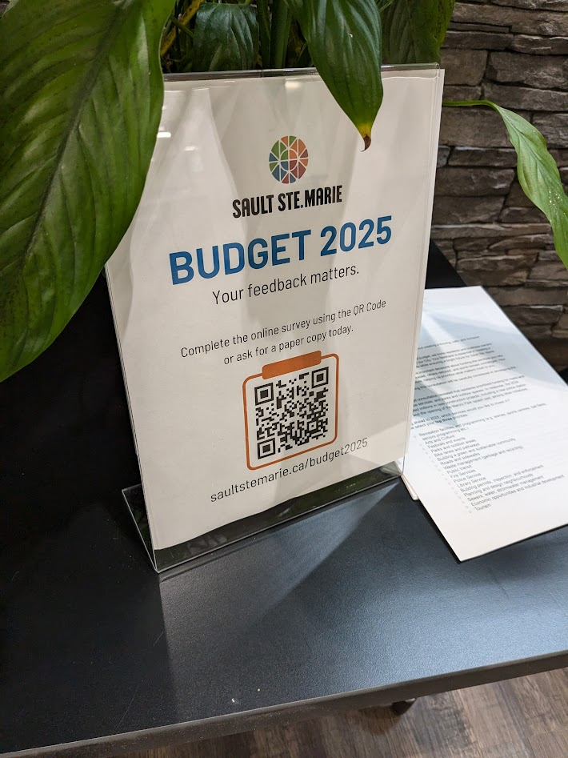
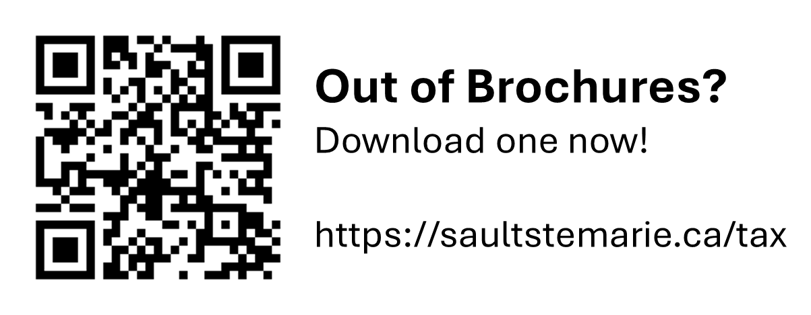
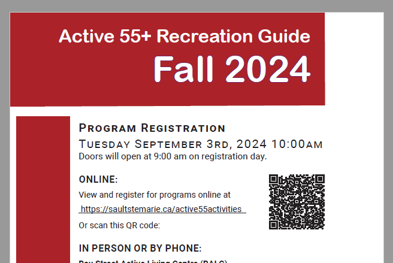
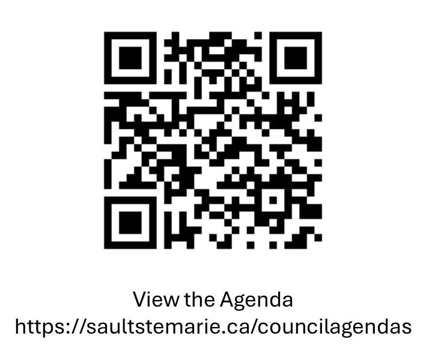

[Home](https://cityssm.github.io/tip-of-the-month/)

# Increase Your Service Level with QR Codes

**Tip of the Month - December 2024**

You've probably seen square-shaped barcodes like the one above.
It's a [QR Code (or Quick-Response Code)](https://en.wikipedia.org/wiki/QR_code),
a popular barcode format that is extremely versatile,
with many applications that can easily improve your department's service level.

💡 **Not sure how to use QR Codes?** 
Open up your smartphone's camera app, and point the camera at the QR Code.
You don't likely have to take a picture. Just look for the link or information to appear on the screen,
and tap on it.

## Possible Use Cases

### The "Never Empty" Brochure Stand

Have you ever visited a stand of flyers or brochures, only to find the one you want is not available?
Oftentimes, those same brochures are available to download from the website, if you know where to look.
Offering a quick way to get to those downloads can easily reduce the frustration of an empty stand.

### Scan Here to Sign Up

Anywhere there is a flyer or sign encouraging users to go to a website to sign up or participate in a process online,
a QR Code could be added to reduce the need for users to type out a potentially long, punctuation-filled
website address.

### Meeting Resources

Have you ever been to a public meeting, and wanted a copy of the agenda?
A QR Code could be posted at the door of meeting, linking to a webpage containing the agenda document,
and other supporting materials.

### Increase Accessibility and Offer Translations

Have a sign or plaque that's only in English?
A QR Code could be placed next to the sign, linking to a webpage containing all of the information from the sign.
Once that information is on the user's smartphone, the user could use their translation app
to get the sign's text in their preferred language.
They could also use their phone's text-to-voice features to have the sign read to them.

### More Ideas

- A QR Code at a venue to offer a list of upcoming events.
- A QR Code at an event entrance to check in.

#### Even More Ideas

QR Codes aren't just for quick access to websites.

- Add a QR Code to your business card to help contacts add your details to their smartphone contact lists.
- Create a QR Code associated with an email address to assist park visitors with reporting equipment issues.

## Tips for Success

✅ **When creating a QR Code for a webpage, try to keep the link short.** 
Packing too much into a QR Code can reduce the reliability of the scanning.

✅ **Provide the link the QR Code corresponds to as text as well.** 
This ensures that those who aren't QR Code-savvy can still follow the link.

✅ **Maintain empty space around the QR Code.** 
Having images, text, and other busy content too close to a QR Code
can make it harder for the scanner to identify it.

✅ **Test your QR Code before you post and share it.** 
Ensure that the QR Code is working for its intended purpose.

✅ **Check on the QR Codes out "in the wild".** 
There is a well known "attack" where someone malicious sticks an alternative QR Code on top of a legitimate one
to redirect unsuspecting users to an alternate website. 😡
QR Codes, especially ones on public signage, should be checked regularly.

## Related Links

🔗 [QR Code Generator](https://www.qr-code-generator.com/) 
A quick search will bring up several QR Code generating websites,
however this one is easy to use without the need to sign up.