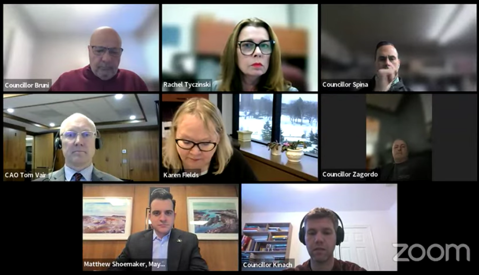

[Home](https://cityssm.github.io/tip-of-the-month/)

# Using Backgrounds in your Online Meetings

**Tip of the Month - January 2025**

By now, most people working in office environments have had to participate
in at least one online meeting. When you turn on the camera, it's about seeing you,
but your background can sometimes distract from that.

Maybe you're office space is busy, or there's something in the background that
shouldn't be shared with the greater audience. Maybe you're working from home,
and don't want to invite your colleagues to your kitchen table.
Maybe you're taking the meeting from the beach at your vacation resort, and
don't want to make everyone else on the call jealous.

Whatever the reason is, it's perfectly acceptable to blur your background,
or replace your background with an (appropriate) image of your choice.

Each meeting application does it a bit differently.
Here's links to the documentation for the major ones.

- [**Google Meet** - Change background & apply visual effects in Google Meet](https://support.google.com/meet/answer/10058482?hl=en&co=GENIE.Platform%3DDesktop)
- [**Microsoft Teams** - Changing your Background in Microsoft Teams Meetings](https://support.microsoft.com/en-us/office/change-your-background-in-microsoft-teams-meetings-f77a2381-443a-499d-825e-509a140f4780)
- [**Zoom** - Changing Your Virtual Background Image](https://support.zoom.com/hc/en/article?id=zm_kb&sysparm_article=KB0060387)