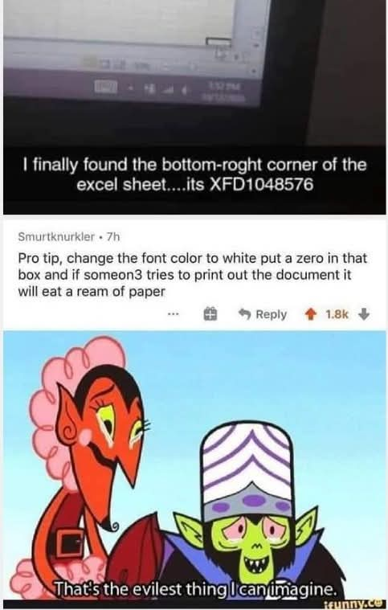
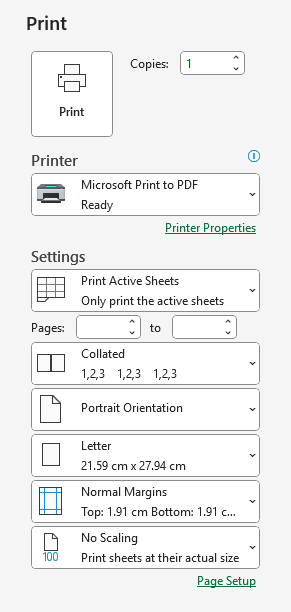
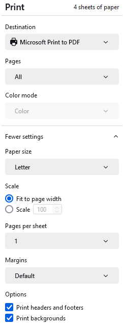
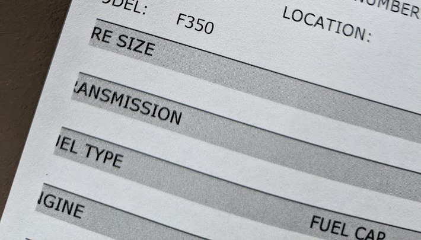
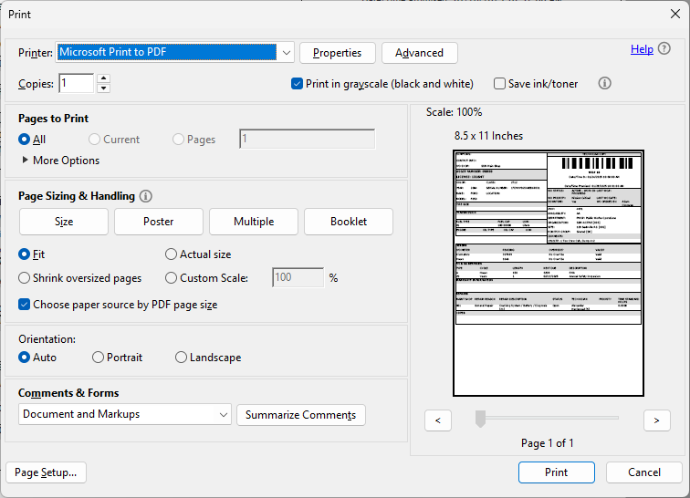

[Home](https://cityssm.github.io/tip-of-the-month/)

# The Importance of Print Preview

**Tip of the Month - February 2025**

This month's tip was inspired by a meme I saw on Facebook.

Forgive the spelling. 🤦‍♂️

This devious trick does work though. I created a new Excel spreadsheet, scrolled down to a row in the 6000s,
a typed a single letter. (I didn't quite make it as far down as the cell mentioned in the picture.)
With default settings, the number of pages to print the single letter, **over 150**!

Many applications offer previews of what their print outs will look like,
and the number of pages that will be used.

Fairly standard options among print previewers include:

- **Page selection**, printing only the pages you need, and not the ones you don't.
- **Double-sided printing**, reducing the number of pages by using both sides of the paper.
- **Color settings**, printing expensive colourful documents in black and white.
- **Scaling**, reducing the size of the printed material by a percentage to fit more on a page.

Here are some application specific print preview settings you should familiarize yourself with.

## Microsoft Excel

Large Excel spreadsheets can be hard to print, but some options can help improve the results
and reduce the waste.

- If you want to print an entire sheet, select "**Print Active Sheets**".
  If not all of that sheet needs to be printed, highlight the cells you want to print,
  then choose "**Print Selection**".

- If the sheet is wide, switch to "**Landscape Orientation**" to fit more columns on the page.

- If a single row or column is not quite fitting, try adjusting the margins to "**Narrow**", or a custom option.

- If you don't mind reducing the print out font size, scaling settings can help to "**Fit All Columns on One Page**",
  "**Fit All Rows on One Page**", or fit the entire sheet on one page.

## Web Browsers

Web browsers, like Google Chrome, often disable printing background images by default.
Sometimes there is value in those background colours and images, while other times, their presence makes a mess.
Toggling the "**Print backgrounds**" setting can have very different results.

## Adobe Acrobat

PDF documents come in all sorts of sizes. Even documents that look like they will fit properly on
a piece of paper can exceed margins, resulting in bad printouts.

To ensure nothing is cut off in the print out, instead of using the "Actual size" setting,
switch to "**Fit**".

Acrobat also offers options to print a page as a poster on multiple sheets of paper,
or print multiple pages on a single sheet of paper with "Multiple" or "Booklet" options.

## No Print Preview? Print to a PDF first!

If there's no good way to see what the print results are going to look like before printing,
you could switch the target printer to a PDF printer.
"**Microsoft Print to PDF**" is a PDF printer included with Windows.
Alternatively, there are third party PDF printers available, like [doPDF](https://www.dopdf.com/),
that can also generate PDFs from any application able to print.

Once the PDF is created, you can have a look to see if you're getting the result you want.