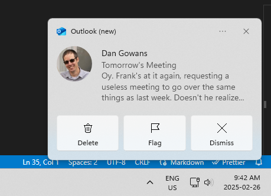
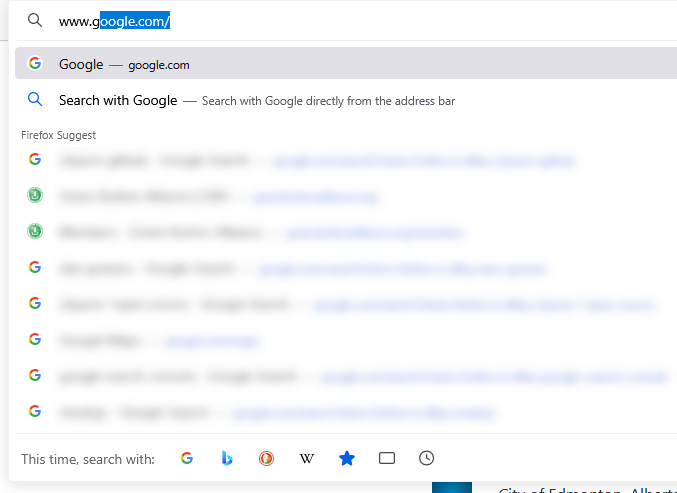

[Home](https://cityssm.github.io/tip-of-the-month/)

# Meeting Room PC Checks

**Tip of the Month - March 2025**

Nobody likes running into problems while running meetings.
If you are relying on a shared meeting room computer for your meeting,
here are some tips to make sure that part of the meeting goes smoothly.

## Before the Meeting

**Allow for at least 10 minutes before the meeting to make sure the computer is working properly.**

- Check that the computer turns on.
- Check that a picture appears on the screen.
- Check that the cordless keyboard and mouse are there **and** charged.
- Check that any applications you may need are available and working.

**Remove any USB drives that may have been forgotten from previous meetings.**

While likely innocent, untrusted USB drives can be security concerns.
If it's not yours, and is not needed for your meeting, it shouldn't be part of your meeting.

**Restart the computer.**

A simple restart will help ensure that any user sessions and applications
used in previous meetings are cleaned up, and will not affect your meeting.

**Shut off any applications that produce notifications that you don't need.**

The major culprit is your email client.
The last thing you want to appear during your meeting is a confidential or embarassing notification.

**Ensure all presenters sit within range for the cordless keyboards and mice.**

If the keyboard and mouse will be passed around a table, reduce disruptions by having the presenters
positioned nearer to the computer.

## During the Meeting

**If using a web browser, use Private Browsing or Incognito Mode.**

This will prevent the browser history associated with your meeting from being saved on the computer
and becoming available to the next user.

**Never save passwords. Never "Remember Me".**

This will prevent credentials from being saved that could allow others access to accounts
after the meeting is over.

## After the Meeting

**Log out of websites and applications.**

Don't trust the computer to log out of things for you.

**Delete any downloaded files.**

Files left behind on the desktop or in the download folder will be available to the next users.
Remember to clear the Recycle Bin too!

**Remember to take any USB drives you used.**

You don't want to lose them.

**Restart the computer.**

This will ensure any applications you ran during the meeting (or may have left running)
are properly cleaned up.
