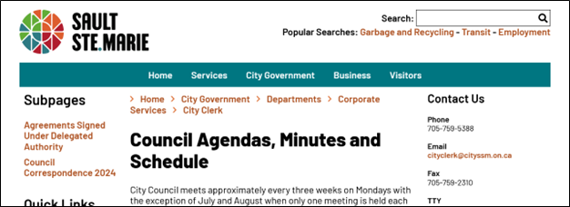
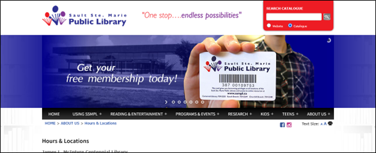
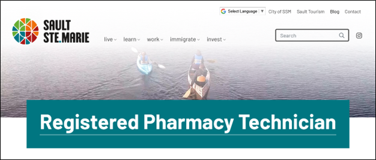
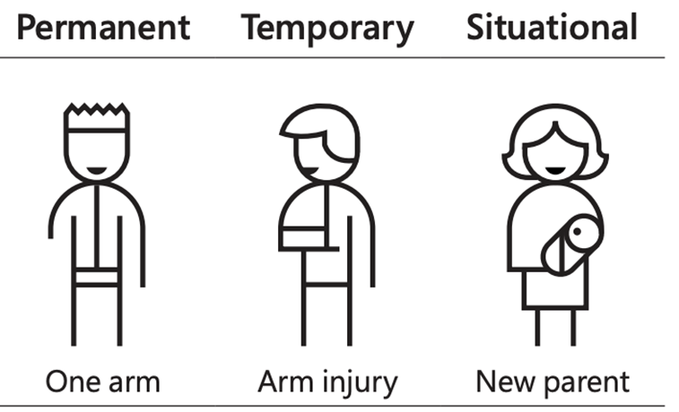

[Home](https://cityssm.github.io/tip-of-the-month/)

# National AccessAbility Week Demo - Browsing Websites Using a Keyboard

**Tip of the Month - June 2025**

**Can you browse the websites below for the information you need using only your keyboard?**

_Note that these tests were **valid in May 2025**, but website content is always subject to change, and the web pages below may not be available later._

## Important Shortcuts

There are more shortcuts available, however for the tests below, these shortcuts should be sufficient and usable in all Windows browsers.

| Key                                        | Description                      |
| ------------------------------------------ | -------------------------------- |
| <kbd>Tab</kbd>                             | Move to the next focus area.     |
| <kbd>Shift</kbd> + <kbd>Tab</kbd>          | Move to the previous focus area. |
| <kbd>Enter</kbd>                           | Activate the current focus area. |
| <kbd>Up Arrow</kbd>, <kbd>Down Arrow</kbd> | Scroll the page up and down.     |

## Test One – Council Meetings

Start on the City of Sault Ste. Marie home page.

<https://saultstemarie.ca/>

❓ When are the council meetings in June 2025?

## Test Two – Saturday Hours

Start on the Library's home page.

<https://ssmpl.ca/>

❓ What are the current Saturday hours for the Library’s North Branch?

## Test Three – Job Search

Start on the Welcome to SSM home page.

<https://welcometossm.com/>

❓ Which local pharmacy currently has a posting for a Registered Pharmacy Technician?

## Why is Keyboard Accessibility Important?

_Image Credit: [Microsoft Inclusive Design](https://inclusive.microsoft.design/)_

Users can rely on keyboards (or other similarly working assistive technologies) for browsing websites for a variety of reasons.

- **Permanent** – Blindness, tremors, paralysis, amputations.
- **Temporary** – Arm injury.
- **Situational** – Holding a baby.

## Common Issues when Browsing with the Keyboard

_Did you experience any of these issues during your tests?_

### Difficulty Visually Tracking the Focused Item

- It is important to include visual cues for keyboard users when elements are focused on. (i.e. border changes, background colour changes)
- It is important for actionable items to receive focus in a logical order and not have focus jump around the page.

### Custom Form Controls

- Standard form controls offer the highest level of accessibility because the way to use them is widely known. This allows assistive technologies to provide specialized tools for them.

### Actionable Elements that Can't Be Focused by Keyboard

- Like the issues that can arise from custom form controls, non-standard buttons and links may end up completely unusable to keyboard users if not done correctly.

### Unusable Drop Menus and Other Navigation Elements

- Expandable menus might not have a keyboard-friendly way to access them.

### Inability to Skip Sections

- Heavy navigation at the top of pages can become tedious for users looking to get to the page content.
- Proper use of headings can help offer reference points in content that (more advanced) keyboard users can jump between.

Note that when other assistive technologies are used at the same time, like screen readers, the number of things to consider when making good, accessible web content increases.

## Test Answers

### ✔️ Test One Answer – Council Meetings

- <https://saultstemarie.ca/Government/City-Departments/Corporate-Services/City-Clerk/Council-Agendas-and-Minutes.aspx>
- June 2, June 16, and June 23.

### ✔️ Test Two Answer – Saturday Hours

- <https://ssmpl.ca/about-us/hours-locations/>
- 10am to 5pm.

### ✔️ Test Three Answer – Job Search

- <https://welcometossm.com/careers/registered-pharmacy-technician/>
- <https://welcometossm.com/careers/registered-pharmacy-technician-2/>
- Westend Pharmasave or IDA.
